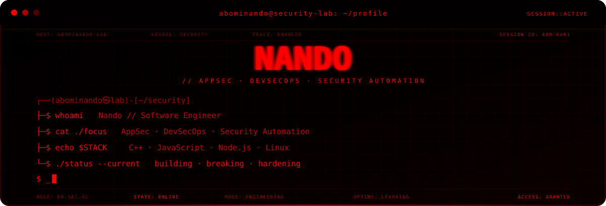

<div align="center">



<br>


</div>

---

## About me

I'm self-taught and mostly focused on the security side of software.

These days I'm spending most of my time on **C++**, **AppSec** and **DevSecOps**. I like digging into how things work under the hood, figuring out where they break, and turning what I learn into small tools and labs.

> **Currently learning:** C++, application security, defensive automation and reverse engineering.

---

## Tech

<div align="center">


</div>

---

## Environment

<div align="center">


</div>

| Current focus | Next up | Exploring |
| --- | --- | --- |
| C++ and low-level fundamentals | AppSec labs | Reverse engineering |
| Cybersecurity | DevSecOps pipelines | Authorized pentesting |
| Linux | Secure coding | Software analysis |
| Defensive automation | Security projects | Internals |

---

## Roadmap

<div align="center">



</div>

---

## Projects

I'm putting together my first public projects with one rule: every repo should show something I can actually build, test, or explain — not just take up space on the profile.

Most of what I plan to publish will be around:

- security-focused CLI tools;
- AppSec labs;
- defensive automation and DevSecOps;
- traffic and system analysis;
- reverse engineering practice;
- writeups from my own labs or environments I'm allowed to test.

```text
~/projects
├── logwatch-cli             [planned]
├── secure-pipeline-lab      [planned]
├── reverse-engineering-lab  [planned]
└── security-orchestrator    [long-term]
```

`security-orchestrator` is the long-term project I want to grow into a modular place for security analysis, auditing and automation tooling.

---

## Contributions

<div align="center">

<picture>
  <source media="(prefers-color-scheme: dark)" srcset="https://raw.githubusercontent.com/abominando/abominando/output/github-contribution-grid-snake-dark.svg">
  <source media="(prefers-color-scheme: light)" srcset="https://raw.githubusercontent.com/abominando/abominando/output/github-contribution-grid-snake.svg">
  
</picture>

</div>

---

## Contact

<div align="center">

<a href="https://github.com/abominando">
  
</a>

<br><br>

`analyze // create // verify // secure // record`

<br><br>

`© 2026 ABOMINANDO // SECURITY LAB`

</div>

> Any security testing or tooling published here is meant for systems I own, isolated labs, or environments where I have explicit permission to test.
