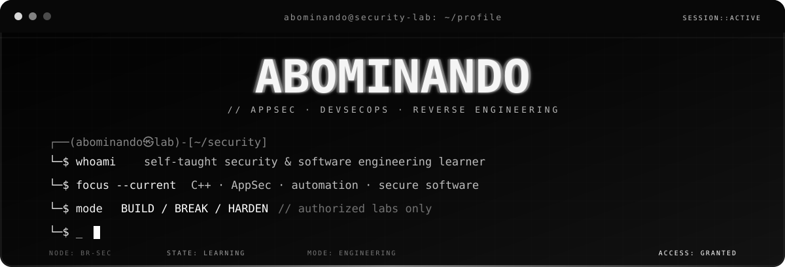

<div align="center">



<br>


</div>

---

## Sobre mim

Sou **autodidata** e direciono meus estudos para a interseção entre **Cybersecurity** e **Engenharia de Software**.

Meu foco é entender software além da interface: como ele funciona internamente, como falhas aparecem, como podem ser identificadas com segurança e como transformar esse conhecimento em ferramentas, automações e sistemas mais resistentes.

> **Foco atual:** C++, AppSec, DevSecOps, automação defensiva e fundamentos de segurança.

---

## Tecnologias

<div align="center">


</div>

---

## Ambiente

<div align="center">


</div>

| Agora | Próximo passo | Explorando |
| --- | --- | --- |
| C++ e fundamentos low-level | Labs de AppSec | Engenharia reversa |
| Cybersecurity | Pipelines DevSecOps | Pentest autorizado |
| Linux | Secure coding | Análise de software |
| Automação defensiva | Projetos de segurança | Internals |

---

## Roadmap

<div align="center">



</div>

---

## Projetos

Estou estruturando os primeiros projetos públicos para que cada repositório demonstre uma habilidade real, e não apenas ocupe espaço no perfil.

Pretendo publicar principalmente:

- ferramentas CLI de segurança;
- laboratórios de AppSec;
- automações defensivas e DevSecOps;
- análise de tráfego e sistemas;
- estudos de engenharia reversa;
- writeups de ambientes próprios ou autorizados.

```text
~/projects
├── logwatch-cli             [planned]
├── secure-pipeline-lab      [planned]
├── reverse-engineering-lab  [planned]
└── security-orchestrator    [long-term]
```

`security-orchestrator` será o projeto principal: uma plataforma modular para integrar ferramentas de análise, auditoria e automação de segurança.

---

## Contribuições

<div align="center">

<picture>
  <source media="(prefers-color-scheme: dark)" srcset="https://raw.githubusercontent.com/abominando/abominando/output/github-contribution-grid-snake-dark.svg">
  <source media="(prefers-color-scheme: light)" srcset="https://raw.githubusercontent.com/abominando/abominando/output/github-contribution-grid-snake.svg">
  
</picture>

</div>

---

## Contato

<div align="center">

<a href="https://github.com/abominando">
  
</a>

<br><br>

`entender // construir // testar // endurecer // documentar`

<br><br>

`© 2026 ABOMINANDO // SECURITY LAB`

</div>

> Projetos de segurança e testes publicados neste perfil são destinados a ambientes próprios, isolados ou explicitamente autorizados.
